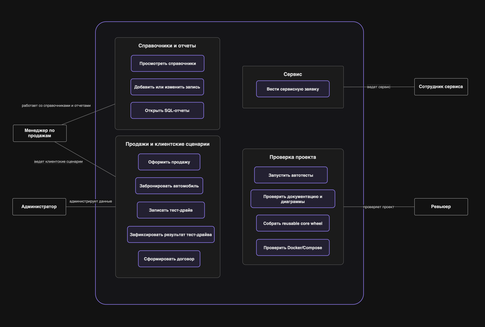
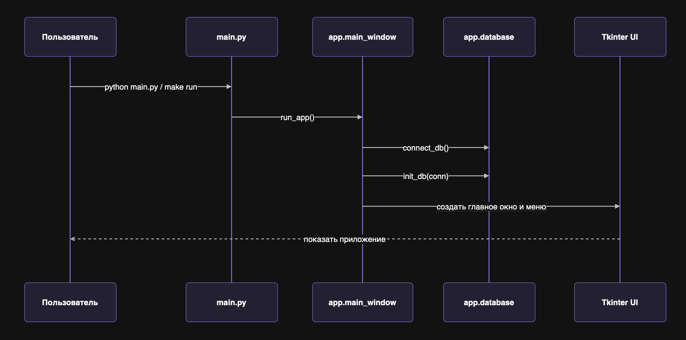
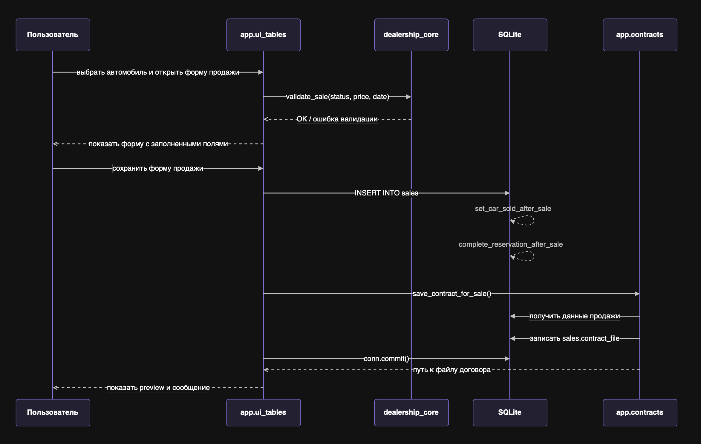

# Архитектура проекта автосалона

## Назначение документа

Этот документ объясняет, как устроен проект после первых этапов инженерного оформления. Где находится запускаемое приложение, где переиспользуемая логика, как приложение работает с SQLite, где формируются договоры и какими проверками защищено текущее поведение.

Документ дополняет `docs/specification.md`. Спецификация описывает предметную область и сценарии, а архитектура показывает границы ответственности между файлами и слоями.

## Слои и ответственность

| Слой | Файлы | Ответственность |
| --- | --- | --- |
| Entry point | `main.py` | Минимальная точка запуска. Импортирует `run_app()` и вызывает его только при запуске файла. |
| Application/UI | `app/main_window.py`, `app/ui_tables.py`, `app/ui_reports.py` | Tkinter-окна, меню, таблицы, формы, кнопки, сообщения об ошибках. |
| Application services | `app/contracts.py`, `app/database.py`, `app/config.py` | Работа с договорами, подключение и инициализация SQLite, конфигурация таблиц и отчетов. |
| Reusable core | `packages/dealership_core/` | Чистые функции форматирования, безопасное имя файла договора, доменная валидация продаж, броней и тест-драйвов. |
| Data/schema | `sql/schema.sql`, `sql/seed_data.sql`, `data/dealership.db` | SQLite-схема, демонстрационные данные, локальная runtime-база. |
| Documents/templates | `templates/`, `contracts/` | Шаблон договора и сгенерированные текстовые договоры. |
| Tests | `tests/smoke/`, `tests/unit/`, `tests/integration/` | Фиксация поведения, проверки reusable core и SQLite-сценариев. |
| Automation/build | `Makefile`, `pyproject.toml` | Единые команды запуска, тестов и сборки reusable core wheel. |
| Documentation | `README.md`, `docs/` | Инструкции запуска, спецификация, архитектура, traceability и редактируемые диаграммы. |

## Диаграммы

Редактируемые исходники диаграмм лежат в `docs/diagrams/`, а PNG-превью - в `docs/diagrams/exports/`. Полный индекс с назначением и местами использования находится в `docs/diagrams/README.md`.

| Диаграмма | Исходник | PNG | Где используется |
| --- | --- | --- | --- |
| Use-case overview | `docs/diagrams/use-cases.drawio.xml` | `docs/diagrams/exports/use-cases.png` | `docs/specification.md`, этот документ |
| Запуск приложения | `docs/diagrams/app-startup-sequence.drawio.xml` | `docs/diagrams/exports/app-startup-sequence.png` | этот документ, `docs/developer-guide.md` |
| Продажа автомобиля | `docs/diagrams/sales-sequence.drawio.xml` | `docs/diagrams/exports/sales-sequence.png` | `docs/specification.md`, этот документ |
| IDEF0 context A-0 | `docs/diagrams/idefA-0_context.drawio.xml` | `docs/diagrams/exports/idefA-0_context.png` | этот документ |
| IDEF0 decomposition A0 | `docs/diagrams/idefA0_decomposition.drawio.xml` | `docs/diagrams/exports/idefA0_decomposition.png` | этот документ |
| IDEF0 sale decomposition A4 | `docs/diagrams/idefA4_decomposition.drawio.xml` | `docs/diagrams/exports/idefA4_decomposition.png` | этот документ |
| ERD SQLite-схемы | `docs/diagrams/schema.dbml` | `docs/diagrams/exports/schema.png` | раздел `Работа с SQLite` |

Use-case overview связывает роли из спецификации с рабочими сценариями приложения. IDEF0-диаграммы показывают функциональную декомпозицию автосалона, а sequence diagrams раскрывают порядок вызовов в двух ключевых runtime-потоках.



## Запускаемый слой

Sequence diagram запуска приложения:

- editable source: `docs/diagrams/app-startup-sequence.drawio.xml`;
- PNG preview: `docs/diagrams/exports/app-startup-sequence.png`.



`main.py` намеренно оставлен маленьким

- импортирует `run_app` из `app.main_window`;
- объявляет `main()`;
- вызывает `main()` только в блоке `if __name__ == "__main__"`.

Такой entry point можно безопасно импортировать в тестах и вспомогательных инструментах - импорт `main` больше не создает Tkinter-окно и не открывает SQLite-базу.

`app/main_window.py` отвечает за создание корневого окна Tkinter, подключение к базе, инициализацию схемы и главное меню приложения. Он не хранит доменные правила сам, а передает действия в UI-модули таблиц и отчетов.

## GUI и прикладная логика

Основные пользовательские сценарии показаны в `docs/diagrams/use-cases.drawio.xml`, а сценарий продажи раскрыт отдельно в `docs/diagrams/sales-sequence.drawio.xml`.



`app/ui_tables.py` отвечает за табличные окна и формы добавления, изменения и удаления записей. Через него пользователь работает с автомобилями, клиентами, сотрудниками, поставщиками, продажами, бронями, тест-драйвами и сервисом.

Ключевой сценарий продажи уже использует reusable core

- пользователь выбирает автомобиль;
- приложение проверяет, что автомобиль доступен для продажи;
- core-валидатор `validate_sale()` проверяет статус, цену и дату;
- после сохранения продажи SQLite-триггеры переводят автомобиль в статус `продана` и завершают активную бронь.

`app/ui_reports.py` отвечает за выбор отчета, ввод параметров и отображение результатов SQL-запроса. Сами SQL-запросы описаны в `app/config.py`, чтобы окно отчетов оставалось универсальным.

## Reusable core

Пакет `packages/dealership_core` содержит код, который не зависит от Tkinter, SQLite connection, путей проекта и файловой системы.

Сейчас в core находятся

- `format_money()` и `format_integer()` для пользовательского отображения чисел;
- `safe_contract_filename()` для безопасного имени файла договора;
- `ValidationError`;
- `validate_sale()`;
- `validate_reservation()`;
- `validate_test_drive()`.

Core проверяется unit-тестами и собирается отдельно от GUI

```bash
make build-lib
```

Команда создает wheel-артефакт в `dist/` стандартным Python-инструментом `build` по метаданным из `pyproject.toml`. Сборка не запускает Tkinter и не требует подключения к SQLite.

## Работа с SQLite

ERD SQLite-модели хранится в `docs/diagrams/schema.dbml`, а PNG-превью находится в `docs/diagrams/exports/schema.png`. DBML используется как редактируемый обзор таблиц и связей для dbdiagram.io, а точным исполняемым source of truth для создания таблиц, ограничений и триггеров остается `sql/schema.sql`.


`app/database.py` отвечает за создание подключения и инициализацию базы

- `connect_db()` открывает SQLite-базу по пути из `app/config.py`;
- включает `PRAGMA foreign_keys = ON`;
- `init_db(conn)` применяет `sql/schema.sql`;
- при необходимости добавляет поля, которые появились после исходного прототипа;
- загружает seed-данные из `sql/seed_data.sql`, если таблица автомобилей пустая;
- добавляет демонстрационные брони, если база уже содержит автомобили.

SQLite-схема хранит не только таблицы, но и часть инвариантов

- `CHECK`-ограничения для статусов и неотрицательных чисел;
- `FOREIGN KEY`-связи между автомобилями, клиентами, сотрудниками и операциями;
- `UNIQUE` для продажи одного автомобиля только один раз;
- триггеры для смены статуса автомобиля после брони или продажи.

Такое разделение означает, что часть правил защищается на уровне reusable core, а часть остается на уровне базы данных как последний рубеж целостности.

## Договоры

`app/contracts.py` отвечает за сценарий договора продажи

1. Получает данные продажи, автомобиля, клиента и сотрудника через SQL-запрос.
2. Форматирует денежные значения и пробег через reusable core.
3. Читает шаблон `templates/contract_template.txt`.
4. Подставляет данные в шаблон.
5. Создает безопасное имя файла через `safe_contract_filename()`.
6. Сохраняет договор в `contracts/`.
7. Записывает относительный путь к файлу в `sales.contract_file`.

Рендер договора находится в application layer, потому что этот сценарий читает шаблон с диска, сохраняет файл и показывает preview через Tkinter. Reusable core используется внутри сценария для форматирования значений и безопасного имени файла.

## Автоматизация

Основные команды собраны в `Makefile`.

| Команда | Назначение |
| --- | --- |
| `make run` | Запускает Tkinter-приложение. |
| `make test` | Запускает automated tests через `unittest discover`. |
| `make check` | Основная локальная проверка проекта. Сейчас зависит от `test`. |
| `make setup` | Создает локальную `.venv` и устанавливает build/coverage tooling без изменения системного Python. |
| `make build-lib` | Собирает reusable core wheel через tooling из `.venv` без запуска GUI. |
| `make coverage` | Запускает тесты через `coverage.py` из `.venv` и формирует отчет покрытия. |

`Makefile` выбирает `python` на Windows и `python3` на macOS/Linux. Команды runtime-проверки используют системный Python, а инструменты сборки и покрытия устанавливаются в project-local `.venv`. Это сохраняет команды воспроизводимыми на Ubuntu 24.04, где системный Python защищен от прямого `pip install`.

## Проверки

Текущая тестовая стратегия разделена по уровню

| Уровень | Папка | Что защищает |
| --- | --- | --- |
| Smoke | `tests/smoke/` | Инициализация SQLite, seed-данные, SQL-отчеты, рендер договора, безопасный импорт `main`. |
| Unit/negative | `tests/unit/` | Helper-функции и доменные валидаторы reusable core, включая ошибочные данные. |
| Integration | `tests/integration/` | SQLite-сценарии продаж и броней: статусы автомобилей, завершение броней, ограничения внешних ключей и уникальности. |

Тесты используют временную SQLite-базу в памяти и не зависят от локального `data/dealership.db`.

## Потоки выполнения

Потоки запуска приложения и продажи автомобиля вынесены в редактируемые Draw.io sequence diagrams:

- `docs/diagrams/app-startup-sequence.drawio.xml`;
- `docs/diagrams/sales-sequence.drawio.xml`.

PNG-превью этих потоков находятся в:

- `docs/diagrams/exports/app-startup-sequence.png`;
- `docs/diagrams/exports/sales-sequence.png`.
