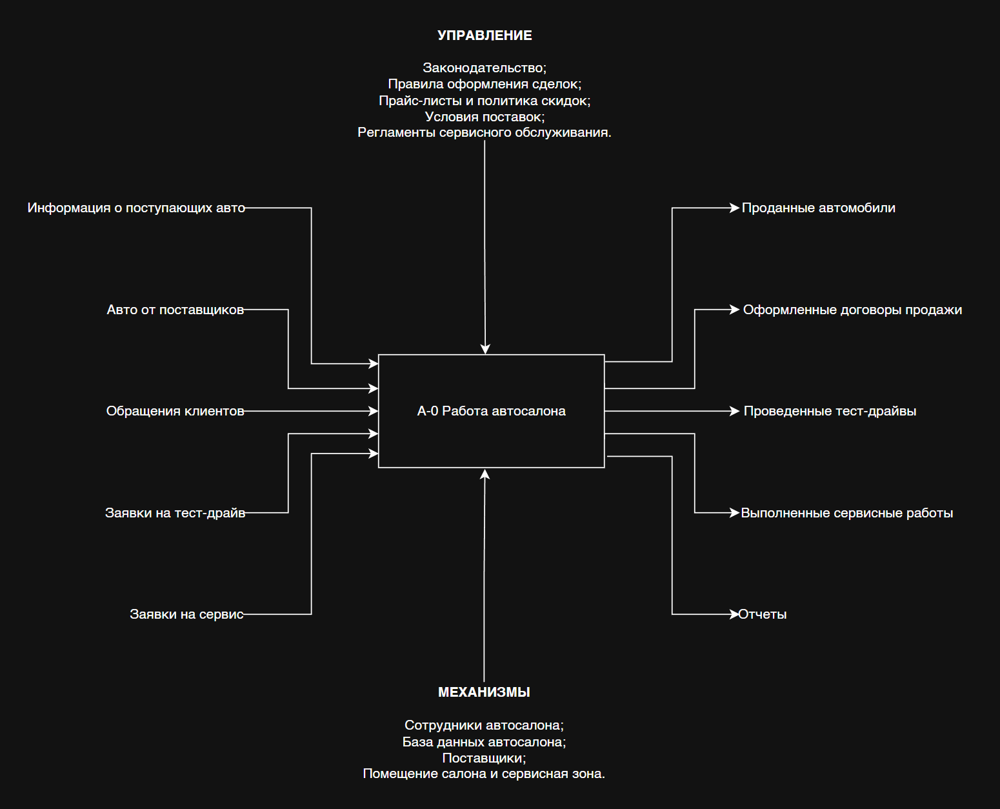
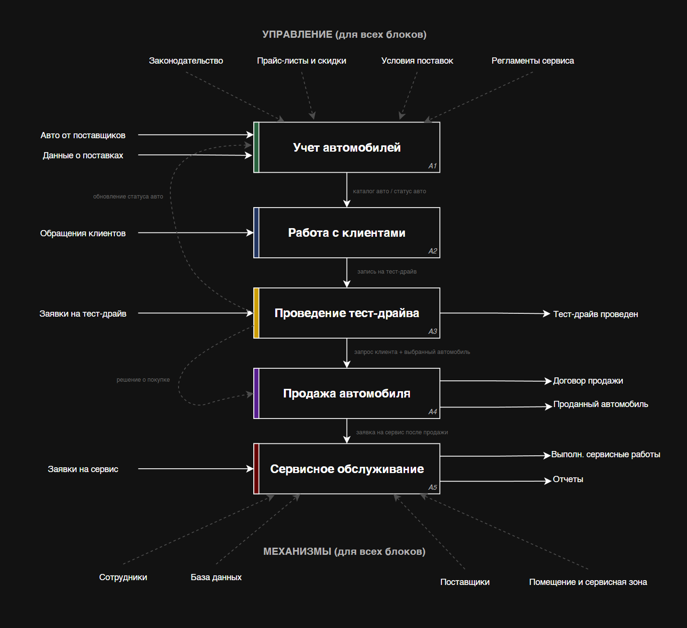
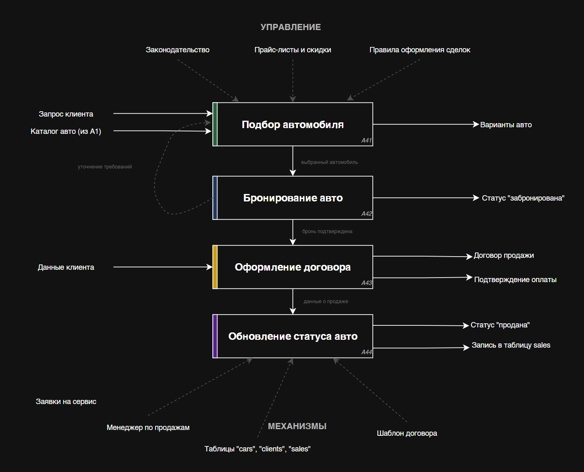
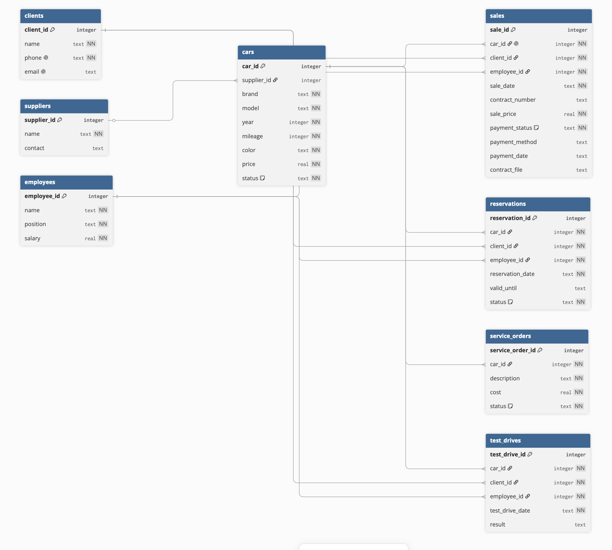
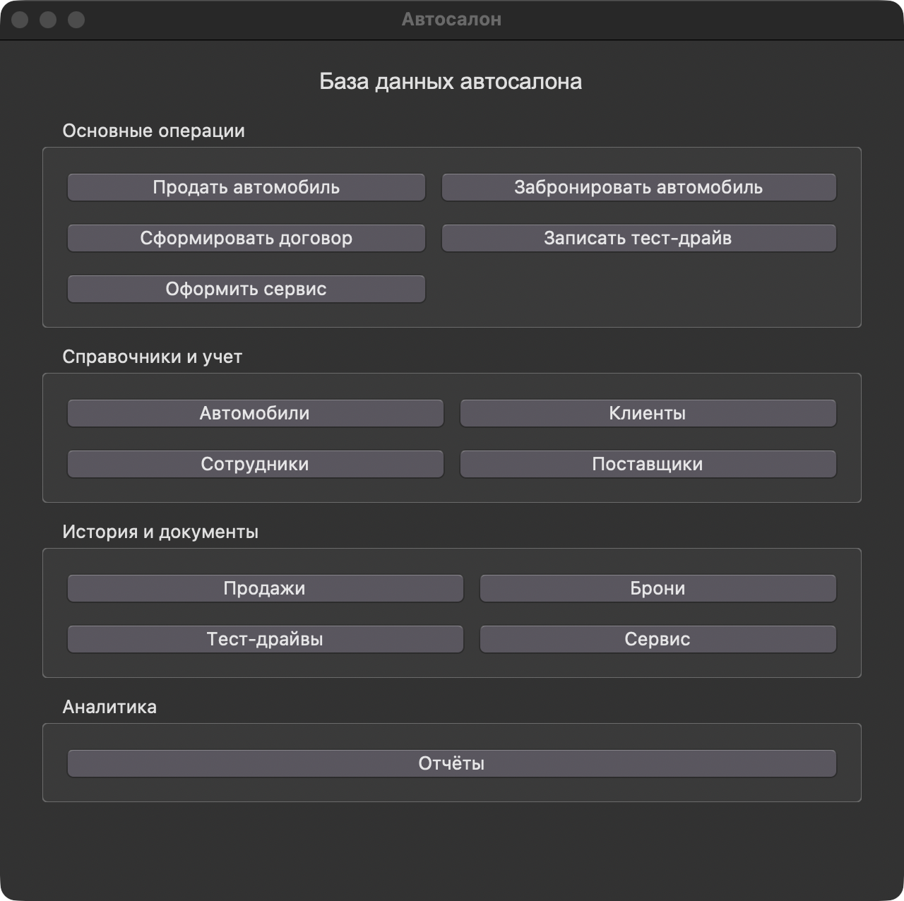
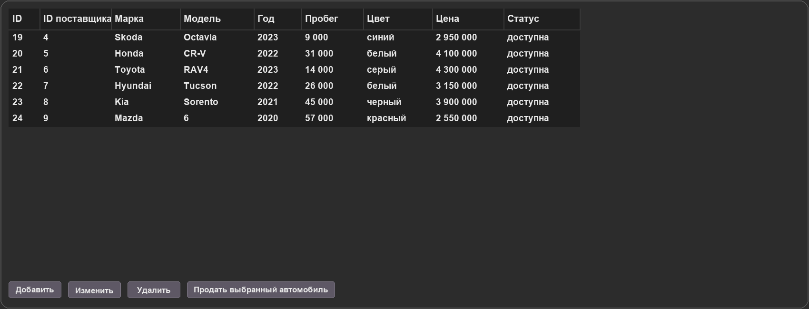
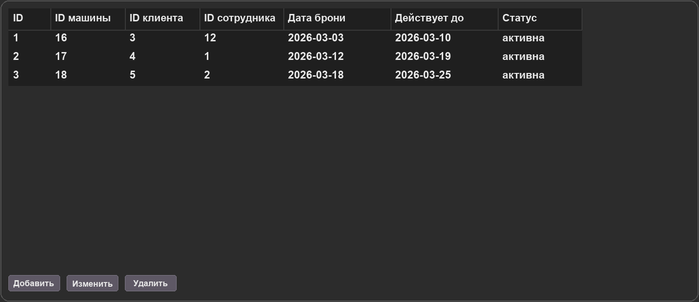
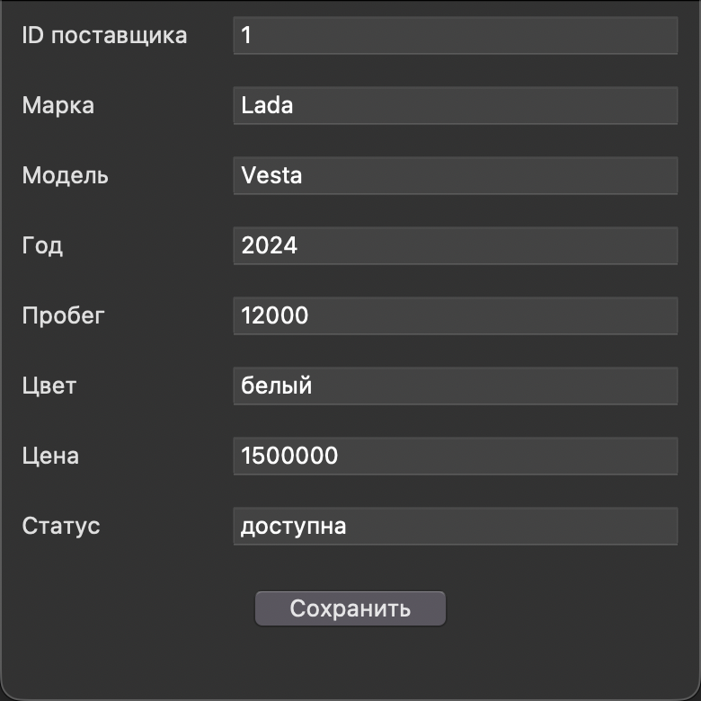
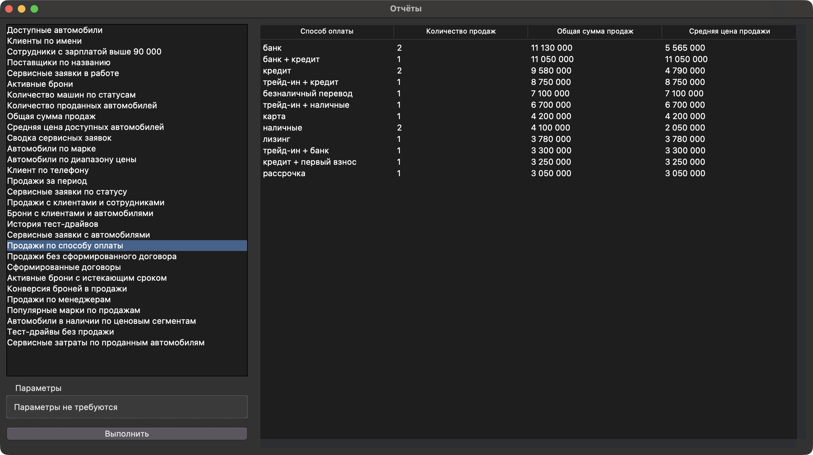

# Отчет по проекту "База данных автосалона"

## 1. Целевая аудитория

Эта база данных сделана для небольшого автосалона. Ей могут пользоваться менеджеры по продажам, администраторы, сотрудники сервиса и руководитель. То есть все, кому в работе нужно быстро посмотреть машины, клиентов, сделки, тест-драйвы или сервисные заявки.

В базе хранятся:
- автомобили с маркой, моделью, годом выпуска, пробегом, цветом, ценой и текущим статусом;
- клиенты и их контактные данные;
- сотрудники автосалона;
- продажи автомобилей;
- тест-драйвы и их результаты;
- сервисные заявки;
- данные для простых отчетов по продажам, автомобилям и сервису.

Идея простая. Вместо отдельных Excel-файлов и записей на бумаге все основные данные лежат в одной базе. Таблицы связаны между собой, поэтому меньше шансов перепутать клиента, автомобиль или сделку.

## 2. Аналоги на рынке

### 1С:Альфа-Авто: Автосалон+Автосервис+Автозапчасти

Это готовое решение для автосалонов, автосервисов и магазинов автозапчастей. Оно работает на платформе 1С:Предприятие 8.3. В зависимости от установки можно использовать файловую СУБД 1С, Microsoft SQL Server, PostgreSQL, Postgres Pro, IBM DB2 или Oracle Database.

Для маленькой организации подходит файловый вариант. Если пользователей много или есть сеть филиалов, обычно выбирают клиент-серверную схему. В системе есть учет автомобилей, продажи, сервис, склад запчастей, CRM, финансы, взаиморасчеты, отчетность и роли сотрудников.

### 1С:Автосервис

Эта программа больше рассчитана на небольшие автосервисы, автомойки и СТО, но часть функций похожа на то, что нужно автосалону. Она сделана на базе 1С:Управление небольшой фирмой и тоже работает через платформу 1С:Предприятие.

СУБД зависит от способа развертывания - можно работать с файловой базой или с серверной СУБД, например Microsoft SQL Server или PostgreSQL. В программе есть клиентская база, автомобили клиентов, заказ-наряды, услуги, запчасти, склад, оплаты и отчеты.

### БИТ.Управление автосервисом и автосалоном

Это решение компании "Первый Бит" на платформе 1С:Предприятие. Оно закрывает задачи автосалона, автосервиса и СТО в одной системе.

Набор СУБД такой же, как у других решений на 1С: файловая база, Microsoft SQL Server, PostgreSQL и другие поддерживаемые варианты. Архитектура может быть файловой или клиент-серверной. Основные возможности включают взаиморасчеты с клиентами и поставщиками, ценообразование, сервисные работы, подбор и нормирование работ, движение запчастей, продажи и отчетность.

### CAR-PROJECT

CAR-PROJECT позиционируется как DMS-система для автодилеров и других участников автомобильного рынка. Она разворачивается на базе конфигурации 1С:Бухгалтерия 8.3, поэтому использует платформу 1С и совместимые с ней СУБД.

Систему можно развернуть локально или использовать как SaaS. Среди функций: учет автомобилей, оформление поступления и продажи, интеграции с внешними площадками, кредитование и страхование, сервис, документооборот, KPI, обращения клиентов и выгрузка данных для BI-аналитики.

## 3. Описание процессов

IDEF0 используется здесь для показа логики работы автосалона. На таких схемах важно отделить сам процесс от того, что на него влияет. Слева показаны входящие данные и заявки, справа результат работы, сверху правила и ограничения, снизу ресурсы, с помощью которых процесс выполняется.

Контекстная диаграмма A-0 показывает автосалон как один общий процесс. На этом уровне не нужно разбирать каждое действие менеджера. Главное здесь то, что автосалон получает автомобили, обращения клиентов и заявки, а на выходе формирует продажи, договоры, проведенные тест-драйвы, сервисные работы и отчеты.

Декомпозиция A0 раскрывает этот общий процесс на основные части. Сначала ведется учет автомобилей, затем идет работа с клиентом, при необходимости проводится тест-драйв, после этого оформляется продажа, а сервисное обслуживание закрывает отдельные заявки и обращения после продажи. Такая последовательность удобна для базы данных, потому что почти каждый шаг оставляет запись в одной из таблиц.

Отдельная декомпозиция A4 нужна потому, что продажа автомобиля является центральным процессом проекта. В ней соединяются данные клиента, выбранная машина, сотрудник, договор и статус автомобиля. После оформления сделки автомобиль уже не должен оставаться доступным, а запись о продаже должна попасть в таблицу `sales`. Поэтому на схеме A4 отдельно выделены подбор, бронирование, оформление договора и обновление статуса.

Проще говоря, IDEF0-схемы показывают не столько детали реализации, сколько границы процессов и движение информации между ними. Это помогает понять, почему в базе появились именно такие сущности - автомобили, клиенты, сотрудники, продажи, бронирования, тест-драйвы и сервисные заявки.

### Диаграммы процессов автосалона

### Контекстная диаграмма A-0



### Декомпозиция A0



### Декомпозиция A4 "Продажа автомобиля"



## 4. Схема данных

В базе восемь связанных таблиц:
- `suppliers` - поставщики автомобилей;
- `cars` - автомобили, их характеристики, пробег, цена, статус и поставщик;
- `clients` - клиенты автосалона;
- `employees` - сотрудники;
- `sales` - продажи, реквизиты договора, оплата и путь к файлу договора;
- `reservations` - бронирования выбранных автомобилей;
- `test_drives` - записи о тест-драйвах;
- `service_orders` - сервисные заявки по автомобилям.

Связи сделаны через внешние ключи. Автомобиль может быть привязан к поставщику. Бронирование и продажа связывают автомобиль, клиента и сотрудника. Тест-драйв устроен похожим образом. Там тоже есть автомобиль, клиент и сотрудник. Сервисная заявка относится к конкретной машине.

### Типовые данные

Для проверки базы подготовлены демонстрационные данные:
- 15 поставщиков;
- 24 автомобиля;
- 20 клиентов;
- 15 сотрудников;
- 15 продаж;
- 3 бронирования;
- 18 тест-драйвов;
- 15 сервисных заявок.

### ERD автосалона



## 5. Файл БД

В проекте используется SQLite. Файл базы данных лежит по пути `data/dealership.db`.

Структура проекта сделана так, чтобы отдельно хранить код приложения, SQL-скрипты, базу данных, шаблоны документов и материалы для отчета.

```text
DB_car_dealership/
├── main.py
├── app/
│   ├── config.py
│   ├── database.py
│   ├── ui_tables.py
│   ├── ui_reports.py
│   └── contracts.py
├── data/
│   └── dealership.db
├── sql/
│   ├── schema.sql
│   ├── seed_data.sql
│   └── queries.sql
├── templates/
│   └── contract_template.txt
├── contracts/
│   └── ДП-0001.txt
├── screenshots/
└── docs/
    ├── diagrams/
    │   ├── idefA-0_context.drawio.xml
    │   ├── idefA0_decomposition.drawio.xml
    │   └── idefA4_decomposition.drawio.xml
    └── report.md
```

`main.py` запускает графическое приложение и собирает главное окно с кнопками. Папка `app` содержит основной код программы. В `config.py` находятся пути к файлам, описания таблиц, подписи полей и готовые отчеты. Модуль `database.py` подключается к SQLite, включает внешние ключи и инициализирует структуру базы через SQL-скрипты. Файл `ui_tables.py` отвечает за окна просмотра, добавления, изменения и удаления записей. В `ui_reports.py` находится окно для выполнения отчетных SQL-запросов. Модуль `contracts.py` формирует договоры продажи по шаблону.

Папка `sql` хранит SQL-часть проекта. В `schema.sql` описаны таблицы и связи между ними, в `seed_data.sql` лежат демонстрационные данные, а `queries.sql` содержит примеры запросов для проверки и отчетности. Папка `templates` нужна для шаблона договора, а готовые договоры сохраняются в `contracts`. Скриншоты интерфейса и готовые PNG-версии диаграмм лежат в `screenshots`. Исходники IDEF-диаграмм в формате Draw.io находятся в `docs/diagrams`, а сам отчет находится в `docs/report.md`.

## 6. Скрин интерфейса

Главная кнопочная форма:



Форма просмотра таблицы автомобилей. Из этого окна можно выбрать доступный автомобиль и сразу открыть форму продажи:



Форма просмотра таблицы бронирований:



Форма добавления записи:



Окно выполнения SQL-запросов с отчетом по способам оплаты:



## 7. SQL запросы

Простые запросы выводят основные данные из таблиц без сложных вычислений.

```sql
-- Простые запросы
SELECT car_id, brand, model, year, mileage, color, price
FROM cars
WHERE status = 'доступна';

SELECT client_id, name, phone, email
FROM clients
ORDER BY name;

SELECT employee_id, name, position, salary
FROM employees
WHERE salary > 90000;

SELECT supplier_id, name, contact
FROM suppliers
ORDER BY name;

SELECT service_order_id, car_id, description, cost, status
FROM service_orders
WHERE status = 'в работе';

SELECT reservation_id, car_id, client_id, employee_id, reservation_date, valid_until, status
FROM reservations
WHERE status = 'активна';
```

Вычисляемые запросы считают количество записей, суммы и средние значения.

```sql
-- Вычисляемые запросы (5 штук, с COUNT/SUM/AVG)
SELECT status, COUNT(*) AS car_count
FROM cars
GROUP BY status;

SELECT COUNT(*) AS sold_cars_count
FROM sales;

SELECT SUM(sale_price) AS total_sales_amount
FROM sales;

SELECT AVG(price) AS average_available_car_price
FROM cars
WHERE status = 'доступна';

SELECT status, COUNT(*) AS order_count, SUM(cost) AS total_service_cost, AVG(cost) AS average_service_cost
FROM service_orders
GROUP BY status;
```

Запросы с параметрами удобны, когда значение известно только во время выполнения, например, марка автомобиля, диапазон цен или период продаж.

```sql
-- Запросы с параметрами (5 штук, параметр обозначен символом ?)
SELECT car_id, brand, model, year, mileage, color, price, status
FROM cars
WHERE brand = ?;

SELECT car_id, brand, model, year, mileage, color, price, status
FROM cars
WHERE price BETWEEN ? AND ?;

SELECT client_id, name, phone, email
FROM clients
WHERE phone = ?;

SELECT sale_id, car_id, client_id, employee_id, sale_date, contract_number,
       sale_price, payment_status, payment_method, payment_date, contract_file
FROM sales
WHERE sale_date BETWEEN ? AND ?;

SELECT service_order_id, car_id, description, cost, status
FROM service_orders
WHERE status = ?;
```

Запросы с JOIN объединяют связанные таблицы. Так в результате видны не только идентификаторы, но и понятные данные, такие как марка автомобиля, имя клиента или имя сотрудника.

```sql
-- Запросы с JOIN
SELECT
    sales.sale_id,
    cars.brand,
    cars.model,
    clients.name AS client_name,
    employees.name AS employee_name,
    sales.sale_date,
    sales.contract_number,
    sales.sale_price,
    sales.payment_status,
    sales.payment_method,
    sales.payment_date,
    sales.contract_file
FROM sales
JOIN cars ON sales.car_id = cars.car_id
JOIN clients ON sales.client_id = clients.client_id
JOIN employees ON sales.employee_id = employees.employee_id;

SELECT
    reservations.reservation_id,
    cars.brand,
    cars.model,
    clients.name AS client_name,
    employees.name AS employee_name,
    reservations.reservation_date,
    reservations.valid_until,
    reservations.status
FROM reservations
JOIN cars ON reservations.car_id = cars.car_id
JOIN clients ON reservations.client_id = clients.client_id
JOIN employees ON reservations.employee_id = employees.employee_id;

SELECT
    test_drives.test_drive_id,
    cars.brand,
    cars.model,
    clients.name AS client_name,
    employees.name AS employee_name,
    test_drives.test_drive_date,
    test_drives.result
FROM test_drives
JOIN cars ON test_drives.car_id = cars.car_id
JOIN clients ON test_drives.client_id = clients.client_id
JOIN employees ON test_drives.employee_id = employees.employee_id;

SELECT
    service_orders.service_order_id,
    cars.brand,
    cars.model,
    service_orders.description,
    service_orders.cost,
    service_orders.status
FROM service_orders
JOIN cars ON service_orders.car_id = cars.car_id;
```

В программе доступны отчеты по способам оплаты, продажам без сформированного договора, сформированным договорам, истекающим активным броням, конверсии броней, продажам по менеджерам, популярным маркам, ценовым сегментам доступных автомобилей, тест-драйвам без продажи и сервисным затратам по проданным автомобилям.